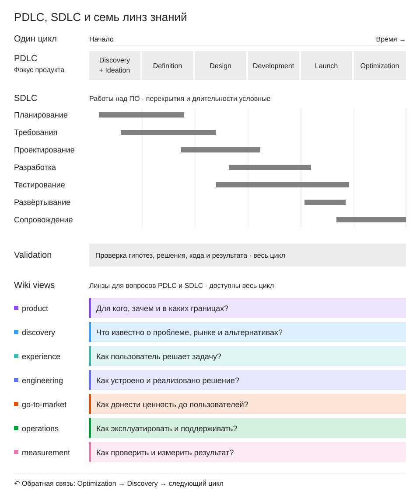
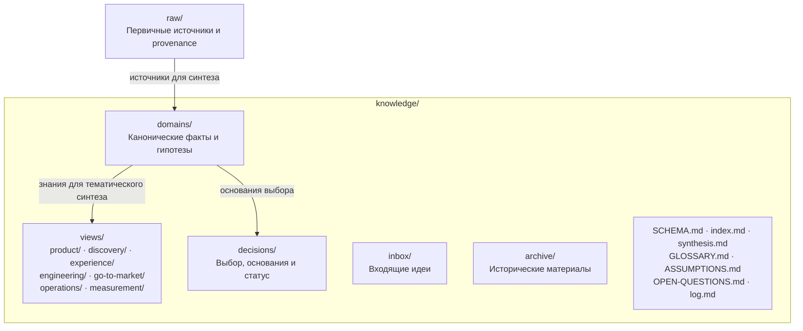

# PDLC LLM Wiki Skills

Восемь `wiki-*` работают с wiki в Git: сохраняют источники, обобщают знания,
записывают решения и связывают требования со сценариями OpenSpec.
Набор сохраняет происхождение, противоречия и неизвестные.
Факт, гипотеза, решение, спецификация, реализация и наблюдение в runtime имеют разные основания.
Правила принятия решений, Git, CI и публикации задаёт целевой проект.

| Skill | Задача | Запись |
| --- | --- | --- |
| [wiki-query](skills/wiki-query/SKILL.md) | Ответ по знаниям | Нет |
| [wiki-ingest](skills/wiki-ingest/SKILL.md) | Обработка нового источника | Да |
| [wiki-research](skills/wiki-research/SKILL.md) | Исследование вопроса | Да |
| [wiki-update](skills/wiki-update/SKILL.md) | Обновление по имеющимся основаниям | Да |
| [wiki-decide](skills/wiki-decide/SKILL.md) | Предложение или запись решения | Да |
| [wiki-audit](skills/wiki-audit/SKILL.md) | Проверка оснований и свежести | По разрешению |
| [wiki-merge](skills/wiki-merge/SKILL.md) | Объединение или разделение страниц | Да |
| [wiki-lint](skills/wiki-lint/SKILL.md) | Проверка структуры и смысла | Только fix |

Query, report-only audit и dry-run lint ничего не записывают.
Запись разрешена в пределах запроса; она не разрешает commit или публикацию.
Ingest начинается с источника, research — с вопроса и поиска источников.

## Организация знаний

[Семь тематических линз](skills/wiki-query/references/pdlc.md) охватывают вопросы PDLC и SDLC:
`product`, `discovery`, `experience`, `engineering`, `go-to-market`, `operations`, `measurement`.
Представления живут в `knowledge/views/<lens>/` и опираются на канонические страницы `domains`.
Линзы не задают статусы или обязательную последовательность работ.
Каталоги появляются по содержимому; существующая wiki сохраняет свою структуру.
PDLC содержит шесть этапов, а Validation проходит через все этапы.

### PDLC, SDLC и линзы



Длительности и перекрытия условные. Линзы доступны на протяжении всего цикла.

### Дефолтная структура wiki



Views ссылаются на каноническое знание и добавляют выводы по своим вопросам.
Каталоги появляются по мере наполнения; пути и набор линз настраиваются в `wiki.config.json`.

## Используемые подходы

| Подход | Применение в наборе |
| --- | --- |
| Wiki в Git | Первичные материалы, канонические знания, решения, история и относительные ссылки |
| Тематические линзы PDLC и SDLC | [Представления](skills/wiki-query/references/pdlc.md) по вопросам; этапы цикла описываются отдельно |
| Domain modeling / glossary | Одно каноническое название и `_Avoid_` с причиной; [происхождение адаптации](docs/provenance.md#глоссарий-и-синонимы--2026-10-05) |
| SimpleEn-RU / УТР | [Полный исходный навык и границы применения](skills/wiki-query/references/writing.md) для технического текста |
| Явная трассировка wiki ↔ OpenSpec | [Карты требований и сценариев](skills/wiki-query/references/traceability.md) при подключении проекта |
| Open Knowledge Format (OKF) v0.2 | [Необязательные метаданные](skills/wiki-query/references/metadata.md): источники, содержательные правки, проверки и срок перепроверки |

Идеи OKF применяются в инструкциях агента. CLI пока не разбирает YAML-метаданные;
экспорт в OKF и автоматический граф не реализованы.
Набор не требует миграции существующего корпуса, нового сервиса или изменения профиля.
См. [источник OKF и границы заимствования](docs/provenance.md#метаданные-из-okf--2026-10-09).

## Установка

Нужен Python 3.10+. CLI использует стандартную библиотеку; OpenSpec необязателен.
Для исследования нужен доступ к источникам; иначе агент сообщает ограничение.

Создайте каталог целевого проекта. В checkout набора запустите установщик:

```bash
python3 scripts/install.py /path/to/project --init-wiki
```

При запуске из терминала он спросит, для какого агента установить навыки:

```text
Для какого агента установить навыки?
  1. Claude Code
  2. Codex
  3. OpenCode
```

Введите номер или имя (`claude`, `codex`, `opencode`). Некорректный выбор
повторяет вопрос. `q` отменяет запуск с кодом 0, EOF завершает его с кодом 2,
Ctrl-C — с кодом 130; при отмене на этапе выбора файлы не изменяются.

Для предварительной проверки добавьте `--dry-run`. Чтобы пропустить меню
в терминале или выбрать агента в автоматизации, передайте `--agent`:

```bash
python3 scripts/install.py /path/to/project --agent claude --init-wiki --dry-run
python3 scripts/install.py /path/to/project --agent codex --init-wiki --dry-run
python3 scripts/install.py /path/to/project --agent opencode --init-wiki --dry-run
```

Уберите `--dry-run` для установки. Для существующей wiki уберите `--init-wiki`:

```bash
python3 scripts/install.py /path/to/project --agent codex
```

Скрипт копирует полный набор восьми skills в `.agents/skills/`, CLI — в `bin/wiki/`.
Перед записью он сообщает выбранного агента, каталог проекта и целевые пути.

| Агент | Каталог обнаружения навыков |
| --- | --- |
| Claude Code | `.claude/skills/`: относительные ссылки на `.agents/skills/` |
| Codex | `.agents/skills/` |
| OpenCode | `.agents/skills/`: поддерживаемый agent-compatible каталог |

Схема сверена 2026-10-09 с официальной документацией
[Claude Code](https://code.claude.com/docs/en/skills),
[Codex](https://learn.chatgpt.com/docs/build-skills) и
[OpenCode](https://opencode.ai/docs/skills/).

Без TTY и без флагов выбора используется Codex: сохраняется прежнее копирование
в `.agents/skills/`, stdin не читается. Старый `--claude` означает `--agent claude`
и тоже пропускает меню; сочетание с `--agent codex` или `--agent opencode`
отклоняется до записи. `--claude --agent claude` допустим.

`--init-wiki` добавляет нейтральный корпус и `wiki.config.json`.
Скрипт отклоняет отличающиеся файлы и symlinks до записи; одинаковые файлы пропускает.
AGENTS.md и CI проекта скрипт не меняет; локальный `pdlc-wiki-maintainer` не копируется.

Установка создаёт `skill-version.json`: источник, канал обновлений, commit/tag
и SHA-256 и Unix-права установленных ресурсов. Для checkout с изменёнными ресурсами или
без Git commit неизвестен; это явно записывается в manifest.

Настройте [профиль](skills/wiki-query/references/profile.md): имя, контекст, язык, пути, документы, слои, views, решения и глоссарий.
Устанавливайте восемь skills вместе: они используют [общий контракт](skills/wiki-query/references/contract.md).

OpenSpec выключен: `openspec_root: null`.

Для существующей интеграции укажите её путь.

## Проверка и обновление комплекта

Из корня целевого проекта:

```bash
bin/wiki/update --check
bin/wiki/update --check --json
bin/wiki/update
```

`--check` только читает GitHub и установленный manifest. Обычный запуск
показывает доступную revision и план, затем предлагает обновиться.
Вызов без интерактивного терминала лишь сообщает предложение.
Общий контракт навыков предусматривает одну проверку в начале сессии,
если сетевой доступ разрешён; агент предлагает обновление пользователю.
Ошибка сети не блокирует работу с wiki. Lint/status работают без сети.

Для обновления без подтверждения, в том числе повторной установки той же revision:

```bash
bin/wiki/update --force
```

Канал `main` по умолчанию отслеживает изменения между релизами. Для стабильных
GitHub Releases выберите канал явно:

```bash
bin/wiki/update --channel release --check
bin/wiki/update --channel release
```

После установки канал сохраняется в `skill-version.json`; `--check` ничего
не сохраняет. Отсутствие стабильного release сообщает ошибку без перехода
на `main`. Переключение канала может установить более раннюю revision.
Нужны Python 3.10+ и доступ к публичному GitHub API; лимиты API и ошибки сети
сообщаются как ошибки проверки. Скачивается архив точного commit SHA;
скрипты из архива не исполняются.

Обновление заменяет полный комплект `.agents/skills/wiki-*` и `bin/wiki`.
Без force локально изменённые содержимое или права файлов блокируют весь план. Удалённые управляемые
файлы восстанавливаются при обновлении. Force разрешает
их замену и сохраняет прежние файлы и manifest в `.wiki-kit-backups/<id>/`.
Удаляются только старые управляемые файлы из manifest. Профиль, `raw`,
`knowledge`, AGENTS.md, CI, aliases и неизвестные файлы сохраняются.
Manifest без поля `modes` читается, но неподтверждённое изменение прав
или удаление управляемого файла требует force.
Symlinks в заменяемых путях отклоняются даже с force.
При ошибке записи CLI восстанавливает прежние файлы; при невозможности
восстановления сообщает пути backup. Прерывание процесса/питания требует
ручной проверки backup: автоматическое восстановление после перезапуска
не предусмотрено. Перед commit проверьте diff; backup можно вынести из
репозитория или удалить после проверки результата.

Для старого установленного комплекта без updater и manifest получите свежий
checkout этого набора и запустите оттуда:

```bash
python3 scripts/update.py /path/to/project --check
python3 scripts/update.py /path/to/project --force
```

До bootstrap текущая версия неизвестна. Force создаёт manifest и сохраняет
отличающиеся известные ресурсы в backup; неизвестные старые файлы не удаляются.
Альтернатива для совпадающих ресурсов — повторная установка свежим `install.py`.
Не обновляйте набор в собственном checkout.

Коды updater: 0 — актуальная версия или успешное обновление; 1 — обновление
доступно, но не выполнено (включая отказ); 2 — ошибка вызова, сети или конфликта.
`--json` используется только с `--check`; `--check` и `--force` несовместимы.

Навыки сохраняют формат Agent Skills и могут обнаруживаться стандартными
установщиками навыков. `skills` CLI переносит каталоги навыков; для этого
набора с отдельным CLI и начальным корпусом используйте полную установку
через `install.py` и обновление через `bin/wiki/update`.

## Проверки

Из корня целевого проекта запустите команды:

```bash
bin/wiki/doctor
bin/wiki/lint --dry-run
bin/wiki/status
bin/wiki/find-orphans
bin/wiki/affected 'понятие или путь'
```

`doctor` проверяет пути профиля, доступность `openspec --version` и OpenSpec
skills для Codex, Claude Code и OpenCode. Он показывает найденные пути и
подсказки, ничего не устанавливает и не исправляет.

```bash
bin/wiki/doctor --require-openspec --tools codex,claude,opencode
bin/wiki/doctor --project /path/to/project --json
```

Без подключения OpenSpec отсутствие CLI/skills даёт предупреждение.
При заданном `openspec_root` либо `--require-openspec` это ошибка;
строгий режим также требует подключённый каталог.
`--tools codex` ограничивает проверку одним агентом; `--timeout 5` задаёт
таймаут запуска CLI в секундах. Коды doctor: 0 — без ошибок, 1 — проблемы
готовности, 2 — неверный вызов, корень или профиль. Warnings допускают код 0.

Область проверки и каталоги skills описаны в
[профиле](skills/wiki-query/references/profile.md#самодиагностика).
Наличие файлов skills не подтверждает их загрузку и разрешения активной
сессии или полноту workflow profile.

При подключении OpenSpec запустите трассировку:

```bash
bin/wiki/trace --json --require-reviewed
```

[Trace](skills/wiki-query/references/traceability.md) проверяет карты wiki ↔ OpenSpec до отдельных сценариев.
Ручной статус `reviewed` и review fingerprint не подтверждают реализацию или runtime.
CLI проверяет структуру; смысл проверяет агент.

Affected показывает кандидатов; агент проверяет полноту влияния.
`bin/wiki/lint --fix` сортирует H2-блоки глоссария в разрешённом scope.
Fix не заменяет смысловую проверку и не меняет решения.
Коды lint: 0 — без ошибок, 1 — ошибки, 2 — неверный вызов или профиль.
Warnings не меняют код.

Навыки используют полный [simple-russian](skills/wiki-query/references/utr-source/skills/simple-russian/SKILL.source.md), чек-лист и примеры.
[Writing](skills/wiki-query/references/writing.md) объясняет режимы, происхождение и границы применения.
Это вспомогательный пересказ ГОСТ Р 58049-2017; CLI не подтверждает соответствие стандарту.

В репозитории набора запустите тесты:

```bash
python3 -m unittest discover -s tests -t .
```

Установку проверяют на временном проекте.
См. [происхождение](docs/provenance.md) и [проверку навыков](docs/skill-validation.md).

## Лицензия

Набор распространяется под [MIT License](LICENSE).
Каждый `wiki-*` содержит `license: MIT` в метаданных и полный текст `LICENSE`,
который копируется при установке.
Включённые материалы SimpleEn-RU сохраняют
[исходную MIT-лицензию и уведомление автора](skills/wiki-query/references/utr-source/LICENSE).
